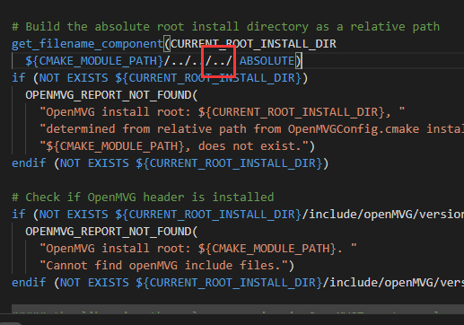

# 基于 Anaconda 的创建 VS 2017 开发环境创建

- 创建环境
```
conda config --add channels conda-forge
conda config --add channels saedrna

conda env create -n osketch -f osketch-fix-version.yml
```

- 完成后，拷贝一些文件

```
conda activate osketch
robocopy ./ %CONDA_PREFIX% h2o.cmake
robocopy ./ %CONDA_PREFIX%/Library/plugins applocal.ps1
robocopy ./ %CONDA_PREFIX%/Library/plugins qtdeploy.ps1
robocopy ./ %CONDA_PREFIX% applocal.ps1
```

- 编辑 ```\Library\share\openMVG\cmake\OpenMVGConfig.cmake``` 文件，这个文件有BUG，这里加一个 ```../```



