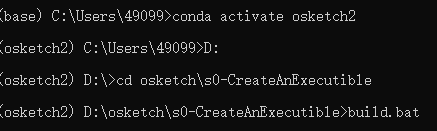
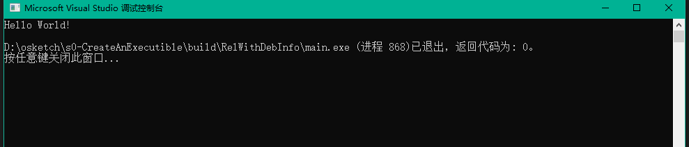
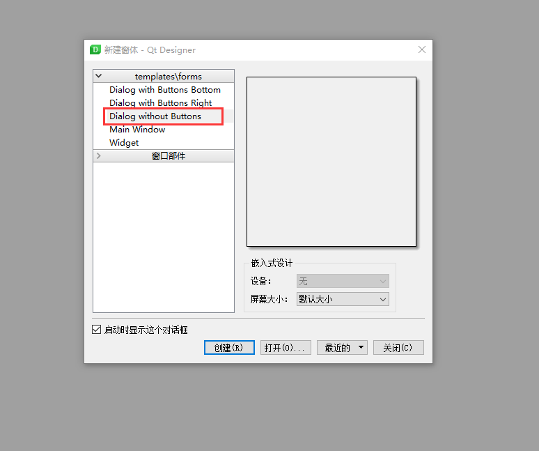
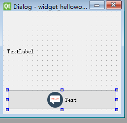
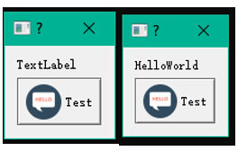
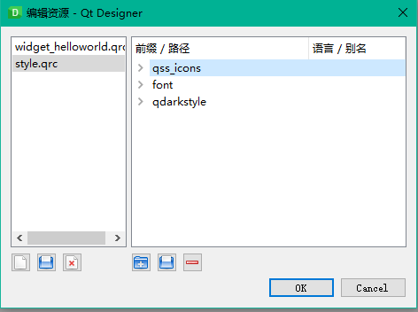
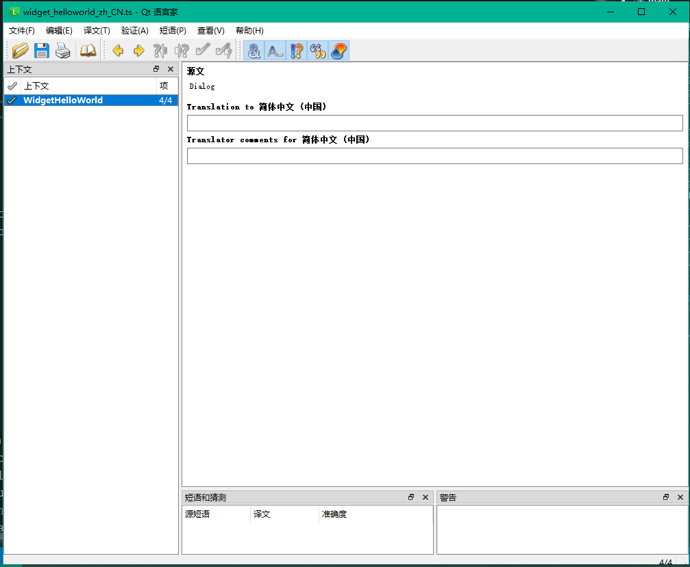

# Table of Contents

- [Table of Contents](#table-of-contents)
- [常用开发工具介绍](#%e5%b8%b8%e7%94%a8%e5%bc%80%e5%8f%91%e5%b7%a5%e5%85%b7%e4%bb%8b%e7%bb%8d)
- [基于 CMake 的 C++ 项目管理方法：以 OSketch 插件开发为例](#%e5%9f%ba%e4%ba%8e-cmake-%e7%9a%84-c-%e9%a1%b9%e7%9b%ae%e7%ae%a1%e7%90%86%e6%96%b9%e6%b3%95%e4%bb%a5-osketch-%e6%8f%92%e4%bb%b6%e5%bc%80%e5%8f%91%e4%b8%ba%e4%be%8b)
  - [为什么要采用 CMake 来管理 C++ 代码？](#%e4%b8%ba%e4%bb%80%e4%b9%88%e8%a6%81%e9%87%87%e7%94%a8-cmake-%e6%9d%a5%e7%ae%a1%e7%90%86-c-%e4%bb%a3%e7%a0%81)
  - [CMake step-by-step](#cmake-step-by-step)
  - [OSketch 开发教程](#osketch-%e5%bc%80%e5%8f%91%e6%95%99%e7%a8%8b)
- [科学论文写作思路与方法](#%e7%a7%91%e5%ad%a6%e8%ae%ba%e6%96%87%e5%86%99%e4%bd%9c%e6%80%9d%e8%b7%af%e4%b8%8e%e6%96%b9%e6%b3%95)

# 常用开发工具介绍

- [Visual Studio Code](https://code.visualstudio.com/)，轻量化的代码编辑器与 IDE
  - 开源免费
  - 跨平台
  - 和 notepad++ 区别
  - 支持多种语言，C++、JS、HTML、Python、Ruby、LaTeX。。。
  - 支持和控制台、Git 等代码管理工具的集成
- [Visual Studio 2017](https://docs.microsoft.com/en-us/visualstudio/releasenotes/vs2017-relnotes)
  - C++ 编译器：GCC、Clang、MSVC、MinGW-64、MSYS2
  - ABI，Application Binary Interface，不同编译器[差别](https://shaharmike.com/cpp/std-string/)
  - VS 2015、2017、2019之间的兼容性问题，请见[链接](https://docs.microsoft.com/zh-cn/cpp/porting/binary-compat-2015-2017?view=vs-2019)
  - 但是最好还是用相同版本，QT 已知存在不兼容性以及[_ENABLE_EXTENDED_ALIGNED_STORAGE](https://devblogs.microsoft.com/cppblog/stl-features-and-fixes-in-vs-2017-15-8/)
- [CMake](https://cmake.org/)，代码配置工具
- [git](https://git-scm.com/download/win)，代码库管理软件
  - git [简明教程](https://product.hubspot.com/blog/git-and-github-tutorial-for-beginners)
- [GitKraken](https://www.gitkraken.com/)，可视化 git 管理软件
- [Anaconda](https://docs.conda.io/en/latest/miniconda.html)，依赖库管理工具
  - 我个人维护的第三方库，[二进制下载](https://anaconda.org/saedrna/repo)，[编译源码](https://github.com/saedrna/AnacondaRecipies)
  - 最简单的创建第三方支持环境的办法见 [3rdparty](./3rdparty/ReadMe.md)
  - 向 ```anaconda.org``` 部署二进制库的方法见[链接](https://docs.conda.io/projects/conda-build/en/latest/)
- [clang-format](https://clang.llvm.org/docs/ClangFormat.html)，C++ 代码格式化工具
  - 集成到 VS，[CodeBeautifier](https://marketplace.visualstudio.com/items?itemName=MariuszBrzeski.CodeBeautifier)
  - 集成到 VSCode，[ClangFormat](https://marketplace.visualstudio.com/items?itemName=LLVMExtensions.ClangFormat)
  - 工程中放了一个我目前使用的格式化文件 [```.clang-format```](./.clang-format)

# 基于 CMake 的 C++ 项目管理方法：以 OSketch 插件开发为例
## 为什么要采用 CMake 来管理 C++ 代码？
- 更方便的管理第三方库依赖
- 文本管理，更简洁，可跟踪改变
- 通过阅读代码，可更好的知道发生了什么，更重要的是可以不用知道我需要知道什么
- 更方便支持批量化修改，适合较大工程开发

## CMake step-by-step
- 创建一个控制台程序
  - 先创建一个文件夹，命名为 s0-CreateAnExecutible 。在该文件夹下添加一个源文件命名为main.cpp，再添加一个 CMakeLists.txt。
  - CMakeLists.txt文件中，第一行为：
    ```cmake
    cmake_minimum_required(VERSION 3.0) #必需：用于规定需要使用 的 cmake 版本。
    ```
    第二行为：
    ```cmake
    project(CMakeTutorial LANGUAGES C CXX) #必需：定义所创建项目的名称。
    ```
    接下来的内容为工程所需配置信息。
    ```cmake
    set(CMAKE_CXX_STANDARD 11) #使用的标准版本

    set(VERSION_MAJOR "0")
    set(VERSION_MINOR "1")
    set(VERSION_BugFix "0")
    set(PROJECT_VERSION ${VERSION_MAJOR}.${VERSION_MINOR}.${VERSION_BugFix})
    #上面的四行为具体版本号
    if(MSVC)
        set(CMAKE_CXX_FLAGS "${CMAKE_CXX_FLAGS} /bigobj /MP /wd4996 /wd4819 /wd4251 /wd4267 /wd4244 /wd4275 /wd4005 /wd5033 /wd4018")
        add_definitions(-DGLOG_NO_ABBREVIATED_SEVERITIES -DWIN32_LEAN_AND_MEAN -DNOMINMAX -D_ENABLE_EXTENDED_ALIGNED_STORAGE) # windows use windows api
    endif(MSVC)
    #if中是忽略了常见的一些无用警告和bug
    ```
    最后添加一行：
    ```cmake
    add_executable(main main.cpp)  #将创建的cpp加入程序中
    ```
  - 在 s0-CreateAnExecutible 文件夹下添加一个 build.bat 文件，文件中添加如下代码：
     ```cmake
    mkdir build
    cd build

    cmake -G "Visual Studio 15 2017" -A "x64" -T "host=x64" ^
        -DCMAKE_TOOLCHAIN_FILE=%CONDA_PREFIX%/h2o.cmake ^
        -DCMAKE_BUILD_TYPE=Release ^
        ../
    ```
  - 接下来需要在配置好的anaconda环境下对其进行编译（环境配置方法点[这里](3rdparty/ReadMe.md)）。
  
  - 若编译成功，s0-CreateAnExecutible 文件夹下会出现一个名为 build 的文件夹。打开其中的 CMakeTutorial.sln 即可看到编译好的解决方案。此时就可以进行进一步的功能添加等操作了。此处以控制台输出 ``` Hello World``` 为例。在 main.cpp 下添加如下代码：
  ```c++
    #include <iostream>

    int main(int argc, char** argv){
        std::cout << "Hello World!" << std::endl;
        return 0;
    }
    ```
    在 ```RelWithDebInfo``` 模式下进行调试（请务必使用该模式调试），将 main 设为启动项目，即可得到以下输出：
    
- 创建一个对话框程序
  - 查找 Qt 库<br>
    创建一个文件夹，命名为 s1-CreateADialog 。同样需要创建一个CMakeLists.txt文件、一个main.cpp文件以及一个 build.bat 文件。其中build文件与前例相同。由于本示例中需要Qt的相关库，因此在上一个示例的CMakeLists基础之上，需要增加如下内容：
    ```cmake
    set(CMAKE_MODULE_PATH "${CMAKE_MODULE_PATH};${CMAKE_CURRENT_LIST_DIR}/cmake")
    set(CMAKE_AUTOMOC ON)
    set(CMAKE_AUTORCC ON)
    set(CMAKE_AUTOUIC ON) #用于编译资源信息

    find_package(Qt5 COMPONENTS Core Gui Widgets LinguistTools REQUIRED)
    #find_package 获取QT5中的Core、Gui等组件
    
    
    ```
    这样，进行后续编译时即可查找到所需的 Qt 库。
  - 创建 UI 文件<br>
    创建UI需要使用 Qt 自带的 Designer 工具进行实现。打开该工具并创建一个 Dialog without Button 类型的窗口。
    <br>
    将 QDialog 类命名为 WidgetHelloWorld ，添加一个 QPushButton 类命名为 btn_test ，添加一个 QLabel 类命名为 lab_text。进行简单排版后界面如下。最终实现的效果为：点击按钮，lab_text 输出Hello World。<br>
    <br>
    将创建好的 UI 文件命名为 widget_helloworld.ui ，并将其保存在 s1-CreateADialog 文件夹下。至此，创建UI完成。

  - 编辑 UI 代码<br>
    对应于上一步中创建的UI，创建相应的头文件 [widget_helloworld.h](cmake-tutorial//s1-CreateADialog/widget_helloworld.h) 和源文件 [widget_helloworld.cpp](cmake-tutorial/s1-CreateADialog/widget_helloworld.cpp) 。两个文件内容只有简单的Qt语法，这里不再赘述。特别强调两个点：在源文件中第一行为如下代码：
    ```c++
    #pragma once 
    ```
    这表示这个头文件在一个单独的编译中只被包含一次。<br>
    源文件的第二行为：
    ```c++
    #include "ui_widget_helloworld.h"
    ```
    注意，此处引用的文件此时还没有被创建，但是由于CMakeLists文件中有```set(CMAKE_AUTOUIC ON)``` ，它会将UI文件转化为```ui_widget_helloworld.h```并用于``` widget_helloworld.h```
    中对对话框进行处理。<br>
    最后，需要在 CMakeLists.txt 的最后添加如下代码，将之前创建的各种文件进行打包和添加。
    ```cmake
    file(GLOB SOURCES *.cpp *.h)
    file(GLOB SOURCES_QT *.ui *.qrc *.ts)
    
    #以上为各类不同的文件进行打包和整理，再通过下一步的add_executable将其全部添加到main之中。
    add_executable(main ${SOURCES} ${SOURCES_QT} ${QM_FILES} ${TS_FILES})

    target_link_libraries(main Qt5::Core Qt5::Widgets Qt5::Gui)
    #将上文中查找到的Qt的组件进行连接
    ```
    至此，编辑UI代码完成。参考创建控制台程序中的流程，此时代码已经可以通过build.bat进行编译。
  - 修改 main.cpp 文件
    打开上一步中生成的 build 文件夹，打开生成的 sln 文件，在 main.cpp 下修改代码。主函数最终代码如下：
    ```c++
    int main(int argc, char **argv) {
    QApplication app(argc, argv);

    WidgetHelloWorld dialog;
    dialog.show();

    return app.exec();
}
    
    ```
    
    编译通过，但是运行提示错误。此处是由于有一插件未自动拷贝所致。在所创建的 anaconda 环境的 plugins 下找到 platforms 插件复制到 s1-CreateADialog\build\RelWithDebInfo  路径下即可成功运行。运行结果如下，点击按钮，即可输出 Hello World 。
  <br>


  - 创建翻译文件以及主题、字体等
    - 更改主题与字体：将主题对应的 darkstyle 文件夹和字体对应的 font 文件夹放入 s1-CreateADialog 文件夹下，打开UI文件进行相关资源的添加。<br>
  <br> 
    在 main.cpp 中添加一个[load_style 函数](cmake-tutorial/s1-CreateADialog/main.cpp)  并调用。
    - 创建翻译文件：为增加界面友好性，需将UI中的英文替换为中文，此时就需要添加一个翻译文件。注意：在进行这一步之前，请确认在 CMakeLists 中查找到了 LinguistTools 模块。<br> 
    在 s1-CreateADialog 文件夹下添加一个cmake文件夹，将 [Qt5LinguistToolsMacrosNoInclude.cmake](cmake-tutorial/s1-CreateADialog/cmake/Qt5LinguistToolsMacrosNoInclude.cmake) 放入该文件夹下。再将 widget_helloworld_zh_CN.ts 放在 s1-CreateADialog 文件夹下。同时，在 CMakeLists文件中添加如下内容对该文件进行加载：
      ```cmake
      include(Qt5LinguistToolsMacrosNoInclude)


      file(GLOB TS_FILES "widget_helloworld_zh_CN.ts")
      file(GLOB TS_SRC_FILES
                "*.h"
                "*.cpp"
                "*.hpp"
                "*.ui"
                "*.qrc")
      qt5_create_translation_no_include(QM_FILES
                                        "${TS_SRC_FILES}"
                                        ${TS_FILES}
                                        OPTIONS
                                        -locations
                                        relative)
      


      add_custom_command(
      TARGET main POST_BUILD
      COMMAND ${CMAKE_COMMAND} -E make_directory
              "$<TARGET_FILE_DIR:main>/resources/"
      COMMAND ${CMAKE_COMMAND} -E copy ${QM_FILES}
              "$<TARGET_FILE_DIR:main>/resources/"
      COMMENT "Copying translation files to $<TARGET_FILE_DIR:main>/resources/"
     )                                   
      ```
     

  然后需要在 main.cpp 添加一个[load_translator函数](cmake-tutorial/s1-CreateADialog/main.cpp) 并调用。然后运行 build.bat ,生成新的 sln 。 打开后双击 ts 文件，出现如下界面，补充对应的中文翻译即可。
  <br>
    生成并运行，运行结果如下：<br>
  <br>  
    至此，创建对话框程序结束。
- 创建一个库文件
  - 创建一个文件夹，命名为 s2-CreateLib 。本示例实现的功能为：在上一个实例的基础上，点击按钮，输出两个数字的和。该文件夹包括：src文件夹、cmake文件夹、build.bat、CMakeLists文件。接着上一个实例中的创建的CMakeLists文件，添加如下内容：
    ```cmake

    set(CMAKE_RUNTIME_OUTPUT_DIRECTORY ${CMAKE_CURRENT_BINARY_DIR}/bin)
    set(CMAKE_LIBRARY_OUTPUT_DIRECTORY ${CMAKE_CURRENT_BINARY_DIR}/lib)
    set(CMAKE_ARCHIVE_OUTPUT_DIRECTORY ${CMAKE_CURRENT_BINARY_DIR}/lib)
     #将所有dll和exe放入bin目录下，将所有lib放入lib目录下。


    include_directories(${CMAKE_CURRENT_LIST_DIR}/src)   
    add_subdirectory(src)
    #连接到src文件夹下，通过src下的cmakelists文件进行进一步处理
    ```
    
    - 对应的，我们看一下src文件夹：包括一个main文件夹、一个mymath文件夹（mymath 下的源文件和头文件实现了简单的加法，此处不做赘述）以及一个 cmakelists 文件。该 cmakelists文件内容为：
    ```cmake
    add_subdirectory(mymath)

    add_subdirectory(main)
    ```
    意为分别加载这两个文件夹中的内容。
   - 这两个文件夹下又分别有cmakelists 文件。mymath文件夹下的cmakelists内容为：
   ```cmake
    file(GLOB SOURCES "*.h" "*.cpp")
    add_library(mymath ${SOURCES})
    #注意此处为library，这样就添加了一个库
    ```
    - 相对于上一个项目，main下的cmakelists文件修改了如下内容：
  ```cmake
    target_link_libraries(main mymath Qt5::Core Qt5::Widgets Qt5::Gui)
    #添加了对mymath 的引用
    void WidgetHelloWorld::clicked_test() {
    int c = myadd(1, 2);
    lab_text->setText(QString::number(c));
    adjustSize();
    //使点击按钮后输出1+2的值
    ```
  - 在 widget_helloworld.cpp 下引用 mymath 中的 myadd 函数。
  ```c++
    void WidgetHelloWorld::clicked_test() {
    int c = myadd(1, 2);
    lab_text->setText(QString::number(c));
    adjustSize();
    //使点击按钮后输出1+2的值
    ```
  - 将缺少的platform插件放入对应位置后即可调试得到正确结果。至此，创建库文件完成。<br>


- 查找第三方库
  - 本示例中实现的功能为：调用 Eigen3 函数库，在 mymath 中实现计算矩阵对角线上的和的功能。
  - 创建一个文件夹。命名为 s3-CreateFindPackage ，内部文件组织形式于上一示例相同，可以复制过来。在cmake 文件夹下添加一个文件 FindEigen3.cmake ，内容及注释点[这里](cmake-tutorial/s3-CreateFindPackage/cmake/FindEigen3.cmake).
  - 在 s3-CreateFindPackage 下的 cmakelists中，添加如下内容：
   ```cmake
    set(Eigen3_INCLUDE_DIR ${CMAKE_PREFIX_PATH}/include/eigen3)
    find_package(Eigen3 REQUIRED)
    ```
  - 在 mymath 的 cmakelists 文件中添加如下内容：
  ```cmake
    target_link_libraries(mymath Eigen3::Eigen3)
    ```
  - 在 mymath.cpp 中添加一个求矩阵对角线和的函数：
   ```c++
    double get_trace(const Eigen::Matrix3d& v)
    {
        return v.diagonal().sum();
    }
    ```
  - 在 widget_helloworld.cpp 下修改 click 函数：
   ```c++
    void WidgetHelloWorld::clicked_test() {
        Eigen::Matrix3d R = Eigen::Matrix3d::Identity();
        lab_text->setText(QString::number(get_trace(R)));
        adjustSize();
      }

    ```
  - 运行 build.bat ,对项目进行编译，得到对应的 sln 。生成并添加缺少的插件后，即可成功运行。至此查找第三方库完成。

- TODO: 修改 ```h2o.cmake applocal.ps1 qtdeploy.ps1``` 等文件，使自动编译可以支持对 qt plugin 的拷贝，目录结构为 ```plugins/platforms``` 等等，参考[vcpkg](https://github.com/microsoft/vcpkg/blob/master/scripts/buildsystems/vcpkg.cmake)

## OSketch 开发教程
- 下载[插件源码和SDK](https://pan.baidu.com/s/162Q3eNI88vPPnic_o8icpA)
- 根据 OSketchProPlugin 的教程完成插件配置
- 添加一个 hello world 插件
- 注册并且添加一个简单的工具类
  - 本示例将实现一个工具类，其功能为：将选中的平面进行高亮，将鼠标置于平面上时会在光标旁显示平面面积，单位为平方米。
  - 在上一步中添加的hello world 插件中，添加一个源文件[tool_area.cpp](osketch-tutorial/oksetchpro_plugin_helloworld/tool_area.cpp)， 和一个头文件[tool_area.h](osketch-tutorial/oksetchpro_plugin_helloworld/tool_area.h)。在编译时，由于其文件名以“tool”开头，这两个文件将被放入解决方案中的Tool Files目录下。代码的运行原理和相关注释请参见代码，部分[ruby接口](https://github.com/ruby/ruby/blob/master/doc/extension.rdoc)可点击进行查阅。
  - 本工具的运行原理为：在打开项目时将该工具进行注册，然后在HelloWold插件下的窗口弹出时点击按钮激活，将选中的平面高亮。
  - 在 ```osketchpro_plugin_helloworld.h``` 中添加一个```post_project_open()``` 函数，该函数为打开项目时所运行的函数。
    
  - 在```osketchpro_plugin_helloworld.cpp``` 中对```post_project_open()```进行调用，并在该函数中对工具进行注册。
    
  - 在将工具类注册以后，需要对其进行激活。在```widget_hello_world.cpp``` 下，使用```set_active_tool```对已经注册好的工具进行激活。
    
  - 最终运行效果如下图所示。
    

# 科学论文写作思路与方法
- 论文结构
- Latex 排版
- 广泛阅读论文
