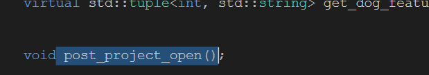
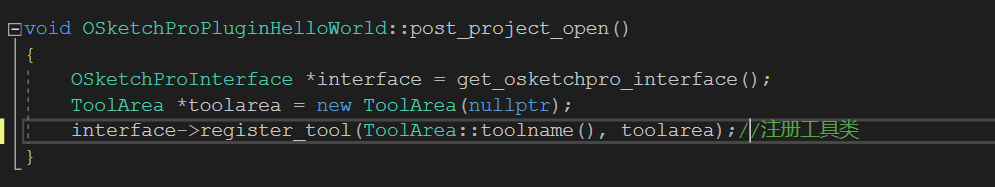
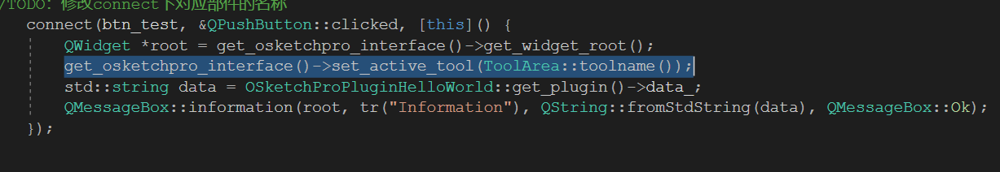
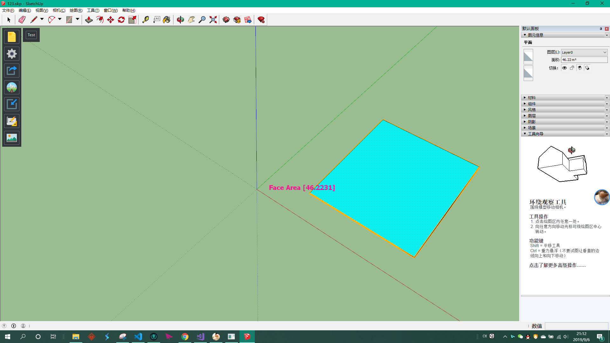

# Table of Contents

- [Table of Contents](#table-of-contents)
- [常用开发工具介绍](#%e5%b8%b8%e7%94%a8%e5%bc%80%e5%8f%91%e5%b7%a5%e5%85%b7%e4%bb%8b%e7%bb%8d)
- [基于 CMake 的 C++ 项目管理方法：以 OSketch 插件开发为例](#%e5%9f%ba%e4%ba%8e-cmake-%e7%9a%84-c-%e9%a1%b9%e7%9b%ae%e7%ae%a1%e7%90%86%e6%96%b9%e6%b3%95%e4%bb%a5-osketch-%e6%8f%92%e4%bb%b6%e5%bc%80%e5%8f%91%e4%b8%ba%e4%be%8b)
  - [为什么要采用 CMake 来管理 C++ 代码？](#%e4%b8%ba%e4%bb%80%e4%b9%88%e8%a6%81%e9%87%87%e7%94%a8-cmake-%e6%9d%a5%e7%ae%a1%e7%90%86-c-%e4%bb%a3%e7%a0%81)
  - [CMake step-by-step](#cmake-step-by-step)
  - [OSketch 开发教程](#osketch-%e5%bc%80%e5%8f%91%e6%95%99%e7%a8%8b)
- [科学论文写作思路与方法](#%e7%a7%91%e5%ad%a6%e8%ae%ba%e6%96%87%e5%86%99%e4%bd%9c%e6%80%9d%e8%b7%af%e4%b8%8e%e6%96%b9%e6%b3%95)

# 常用开发工具介绍

- [Visual Studio Code](https://code.visualstudio.com/)，轻量化的代码编辑器与 IDE
  - 开源免费
  - 跨平台
  - 和 notepad++ 区别
  - 支持多种语言，C++、JS、HTML、Python、Ruby、LaTeX。。。
  - 支持和控制台、Git 等代码管理工具的集成
- [Visual Studio 2017](https://docs.microsoft.com/en-us/visualstudio/releasenotes/vs2017-relnotes)
  - C++ 编译器：GCC、Clang、MSVC、MinGW-64、MSYS2
  - ABI，Application Binary Interface，不同编译器[差别](https://shaharmike.com/cpp/std-string/)
  - VS 2015、2017、2019之间的兼容性问题，请见[链接](https://docs.microsoft.com/zh-cn/cpp/porting/binary-compat-2015-2017?view=vs-2019)
  - 但是最好还是用相同版本，QT 已知存在不兼容性以及[_ENABLE_EXTENDED_ALIGNED_STORAGE](https://devblogs.microsoft.com/cppblog/stl-features-and-fixes-in-vs-2017-15-8/)
- [CMake](https://cmake.org/)，代码配置工具
- [git](https://git-scm.com/download/win)，代码库管理软件
  - git [简明教程](https://product.hubspot.com/blog/git-and-github-tutorial-for-beginners)
- [GitKraken](https://www.gitkraken.com/)，可视化 git 管理软件
- [Anaconda](https://docs.conda.io/en/latest/miniconda.html)，依赖库管理工具
  - 我个人维护的第三方库，[二进制下载](https://anaconda.org/saedrna/repo)，[编译源码](https://github.com/saedrna/AnacondaRecipies)
  - 最简单的创建第三方支持环境的办法见 [3rdparty](./3rdparty/ReadMe.md)
  - 向 ```anaconda.org``` 部署二进制库的方法见[链接](https://docs.conda.io/projects/conda-build/en/latest/)
- [clang-format](https://clang.llvm.org/docs/ClangFormat.html)，C++ 代码格式化工具
  - 集成到 VS，[CodeBeautifier](https://marketplace.visualstudio.com/items?itemName=MariuszBrzeski.CodeBeautifier)
  - 集成到 VSCode，[ClangFormat](https://marketplace.visualstudio.com/items?itemName=LLVMExtensions.ClangFormat)
  - 工程中放了一个我目前使用的格式化文件 [```.clang-format```](./.clang-format)

# 基于 CMake 的 C++ 项目管理方法：以 OSketch 插件开发为例
## 为什么要采用 CMake 来管理 C++ 代码？
- 更方便的管理第三方库依赖
- 文本管理，更简洁，可跟踪改变
- 通过阅读代码，可更好的知道发生了什么，更重要的是可以不用知道我需要知道什么
- 更方便支持批量化修改，适合较大工程开发

## CMake step-by-step
- 创建一个控制台程序
- 创建一个对话框程序
  - 查找 Qt 库
  - 创建 UI 文件
  - 编辑 UI 代码
  - 创建翻译文件
- 创建一个库文件
- 查找第三方库
- TODO: 修改 ```h2o.cmake applocal.ps1 qtdeploy.ps1``` 等文件，使自动编译可以支持对 qt plugin 的拷贝，目录结构为 ```plugins/platforms``` 等等，参考[vcpkg](https://github.com/microsoft/vcpkg/blob/master/scripts/buildsystems/vcpkg.cmake)

## OSketch 开发教程
- 下载[插件源码和SDK](https://pan.baidu.com/s/162Q3eNI88vPPnic_o8icpA)
- 根据 OSketchProPlugin 的教程完成插件配置
- 添加一个 hello world 插件
- 注册并且添加一个简单的工具类
  - 本示例将实现一个工具类，其功能为：将选中的平面进行高亮，将鼠标置于平面上时会在光标旁显示平面面积，单位为平方米。
  - 在上一步中添加的hello world 插件中，添加一个源文件[tool_area.cpp](osketch-tutorial/osketchpro_plugin_helloworld/tool_area.cpp)， 和一个头文件[tool_area.h](osketch-tutorial/osketchpro_plugin_helloworld/tool_area.h)。在编译时，由于其文件名以“tool”开头，这两个文件将被放入解决方案中的Tool Files目录下。代码的运行原理和相关注释请参见代码，部分[ruby接口](https://github.com/ruby/ruby/blob/master/doc/extension.rdoc)可点击进行查阅。
  - 本工具的运行原理为：在打开项目时将该工具进行注册，然后在HelloWold插件下的窗口弹出时点击按钮激活，将选中的平面高亮。
  - 在 ```osketchpro_plugin_helloworld.h``` 中添加一个```post_project_open()``` 函数，该函数为打开项目时所运行的函数。
    
  - 在```osketchpro_plugin_helloworld.cpp``` 中对```post_project_open()```进行调用，并在该函数中对工具进行注册。
    
  - 在将工具类注册以后，需要对其进行激活。在```widget_hello_world.cpp``` 下，使用```set_active_tool```对已经注册好的工具进行激活。
    
  - 最终运行效果如下图所示。
    

# 科学论文写作思路与方法
- 论文结构
- Latex 排版
- 广泛阅读论文
